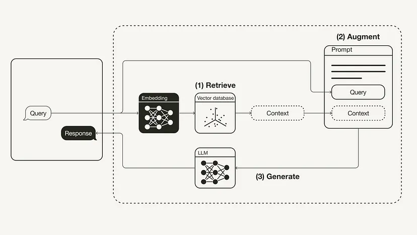

(rag-model)=

# RAG models

RAG (Retrieval Augmented Generation) is a framework that boosts the accuracy and performance of your Generative AI application's large language model (LLM). It does this by providing the most pertinent and contextually significant proprietary, private, or dynamic data during tasks.

## Why is RAG in AI / LLM

Retrieval Augmented Generation (RAG) in AI enhances Generative AI applications like [ChatGPT](https://openai.com/blog/chatgpt) and [Claude](https://claude.ai/) by fetching relevant results from a database during generation.
  
**LLM Limitations**:
   - **Static Nature**: LLMs lack up-to-date information as they cannot update their training datasets.
   - **Lack of Domain-specific Knowledge**: They are trained for generalized tasks and do not understand private company data.
   - **Black Box Functionality**: It's challenging to understand which sources LLMs considered for their conclusions.
   - **Inefficiency and Cost**: Production and deployment of foundation models are costly and resource-intensive.

**Impact on GenAI Applications**:
   - **Poor Performance**: Using LLMs "out of the box" without modifications leads to subpar performance in context-dependent tasks.
   - **Context-dependent Tasks**: LLMs struggle with tasks like assisting customers in booking flights due to their lack of contextual understanding.

## How RAG works

It  involves preparing data by gathering and preprocessing documents, indexing them with embeddings, retrieving relevant data based on user queries, and building LLM applications incorporating prompt augmentation and LLM querying into an endpoint.

source: Towards Datascience

1. Retrieve: Use the user query to find relevant context from an external source. Embed the query and context into the same vector space, enabling a similarity search. Return the top k closest data objects.
2. Augment: Combine the user query and retrieved context into a prompt template.
3. Generate: Feed the retrieval-augmented prompt to the LLM.

RAG offers a cost-effective, low-risk way to boost GenAI app performance. It improves response relevance, enhancing user experience. Unlike other methods, RAG addresses context and recency issues simultaneously, making it efficient and reliable.

**📝 Last notes on RAG ...**

Despite RAG's effectiveness, there's a chance of generating or retrieving incorrect information. [Evaluation](./evaluation.md) ensures accuracy, highlighting its importance in verifying the model's performance and maintaining quality standards.